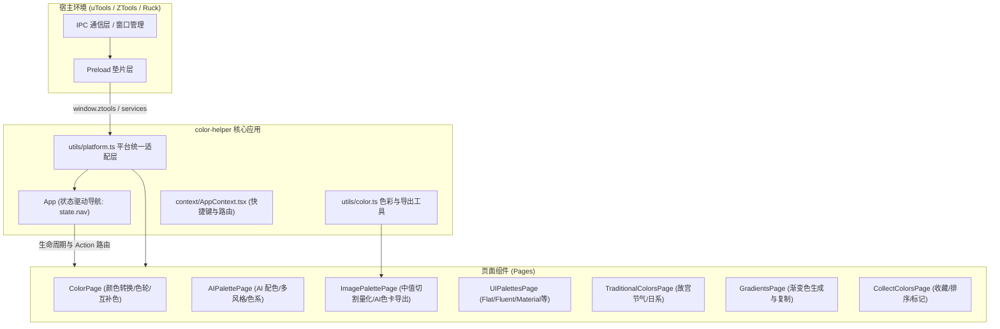

# 颜色助手 (color-helper) 模块架构与契约深度分析

> **知识定位**：记录 `plugins/color-helper` 模块职责、核心接口、数据流向、平台 API 契约与适配痛点，作为后续重构与跨平台运行时的唯一事实标准。

---

## 1. 模块核心职责

`color-helper` 是一款基于 React 18 + TypeScript + MUI + Chroma.js 构建的多功能色彩工具，提供**颜色格式互转**、**色彩和谐方案**、**AI 智能配色与命名**、**图片色卡提取与导出**、**UI 规范色板**、**中国/日本传统色**、**渐变色合集**及**个性化颜色收藏**。

---

## 2. 核心架构与系统组件关系

---

## 3. 核心契约与接口规范

### 3.1 平台适配契约 (`utils/platform.ts` / 宿主桥接)

| 接口分类 | 契约签名 | 输入输出契约 | 当前实现与降级模式 |
| :--- | :--- | :--- | :--- |
| **存储 (Key-Value)** | `dbStorage.getItem(key: string): any` `dbStorage.setItem(key, value)` `dbStorage.removeItem(key)` | 同步存取，持久化用户偏好（如色值去除 `#` 标志） | 优先 `platform.dbStorage`，降级为带前缀 `color_helper_` 的 `localStorage` |
| **文档数据库** | `db.get(id: string): any` `db.put(doc: any): {ok, id, rev}` `db.remove(doc: any)` `db.allDocs(key?: string): any[]` | **同步接口**，用于收藏颜色与排序文档管理；文档需包含 `_id` 与 `_rev` | 优先 `platform.db`，降级为 `localStorage` 模拟 |
| **剪贴板** | `copyText(text: string): void` `copyImage(dataUrl: string): void` | 复制 HEX/RGB 颜色值或 Canvas 生成的渐变图 PNG | 优先平台 API，文本降级至 `navigator.clipboard` |
| **屏幕取色** | `screenColorPick(callback: (res: {hex, rgb}) => void)` | 异步回调返回 HEX / RGB | 优先平台 API，Web 环境降级至 `window.EyeDropper` |
| **屏幕截图** | `screenCapture(callback: (path: string) => void)` | 异步截图并将图片文件路径回调 | 依赖平台 API，Web 环境暂无原生 fallback |
| **AI 配色与命名** | `aiChat(messages, model?): Promise<{content: string}>` `isAIAvailable(): boolean` | 异步请求大模型，要求结构化返回 JSON 或纯文本 | 原生依赖 `platform.ai({ model, messages })` |
| **色卡导出服务** | `window.services.saveColorCard(bf: ArrayBuffer \| number[])` | 将二进制图片缓冲区落盘为文件并唤起资源管理器 | 原生 `preload.cjs` 依赖 Node.js `fs/promises`、`buffer`、`path` |

---

## 4. 数据流向与生命周期边界

### 4.1 插件生命周期与路由分发流
1. **宿主启动**：宿主派发 `onPluginEnter({ code, type, payload })`；
2. **Action 纠偏**：
   - 匹配对应业务页面：`color`（取色/转换）、`ai`（AI 配色）、`image`（图片色卡）、`ui`、`traditional`、`gradient`、`collect`、`pickercolor`；
   - **穿透风险点**：当 Ruck 传入未匹配 code（如 `"default"` 或 `"main"`）时，`App.tsx` 的 `switch (nav)` 会进入 `default: pageContent = false;` 导致**完全白屏**，必须在垫片层纠偏为默认 `"color"`！
3. **Payload 注入**：
   - 若 `type === "regex"`，将匹配到的颜色字符串注入对应页面；
   - 若 `type === "img"` 或 `"files"`，将图片 Data URL 或路径传递至图片提取流程。

### 4.2 收藏数据（`CollectColorsPage`）持久化流
- 页面在 `constructor` 中**同步调用** `db.allDocs()`，遍历解析以 `"color/"` 开头的颜色记录与 `"collectsort"` 排序记录；
- 用户新增/修改/删除颜色时，同步触发 `db.put()` / `db.remove()`；
- **并发与时序边界**：如果底层数据库未能做到冷启动 0ms 恢复，初始化阶段读取将为空，造成收藏列表闪烁甚至数据丢失。必须依托双轨持久化保证同步可用。

### 4.3 图片色卡导出与沙箱边界
- `ImagePalettePage` / `utils/color.ts` 内部通过 Canvas 渲染色卡，输出为 Base64 Data URL；
- 原逻辑在 Node 环境下通过 `Buffer.from` + `fs.writeFile` 落盘；
- **Ruck 沙箱重构点**：在 Webview2 浏览器无 Node.js 全局环境下，垫片层需剥离 Node 原生依赖，改用 Web Blob + 对象 URL 或 Ruck 宿主对话框/文件保存通道进行无感导出。
