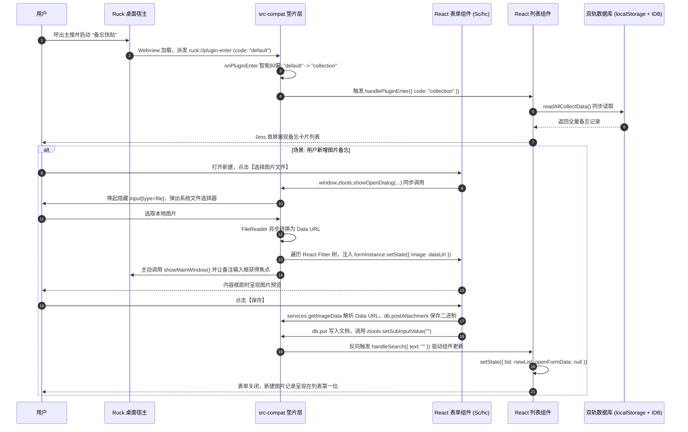

# 备忘快贴 (memo-quick-paste) 适配实战复盘与经典案例

> **案例背景**：`memo-quick-paste` 是一款基于 React 混淆打包的高频生产力工具，功能包含备忘卡片管理、文本/图片增删改查、动态标签、主搜索框直搜（MainPush）、静默速记（Record）与系统级快捷键自动粘贴输出。其具备非常典型的 Electron 原生依赖与复杂的 React 生命周期状态机，是沉淀迁移经验的绝佳案例。

---

## 1. 核心模块与系统时序全景



---

## 2. 真实疑难问题攻坚与根治方案 (Bug Resolution)

### 2.1 Bug 1: 动态标签系统报错 (`TypeError: window.ztools.getFeatures is not a function`)
- **现象**：打开插件控制台直接抛错崩溃。
- **根因分析**：原插件使用 `ztools.getFeatures()` 获取标签选项，使用 `setFeature()` 动态注册新标签为全局指令。
- **解决方案**：
  在 `ztools.js` 中使用 `localStorage` 维护 `ruck_memo_features`：
  ```javascript
  getFeatures() {
    try {
      const raw = localStorage.getItem("ruck_memo_features");
      if (raw) return JSON.parse(raw);
    } catch (e) {}
    return [];
  },
  setFeature(feature) {
    if (!feature?.code) return false;
    const list = this.getFeatures();
    const idx = list.findIndex(i => i.code === feature.code);
    if (idx >= 0) list[idx] = { ...list[idx], ...feature };
    else list.push(feature);
    localStorage.setItem("ruck_memo_features", JSON.stringify(list));
    return true;
  }
  ```

### 2.2 Bug 2: 保存后界面不显示记录，二次保存提示“相同记录已存在”
- **现象**：点击保存后弹窗未关闭且列表没有刷新，再次点击保存却提示数据已存在。
- **根因分析**：
  原插件的 `handleFormSave` 没有显式调用 `setState({ list })`，而是调用 `window.ztools.setSubInputValue(this.state.searchText)`。原设计期望宿主触发子输入框的搜索回调 `handleSearch`，由 `handleSearch` 过滤并更新 `state.list` 以及将 `openFormData` 置为 `null`。原垫片没有反向驱动该回调，且该回调严格要求入参为 `{ text: string }` 对象。
- **解决方案**：
  在 `setSubInputValue` 中记录并主动反向驱动回调：
  ```javascript
  setSubInputValue(value) {
    const text = String(value || "");
    ruck?.ui?.setSubInputValue?.(text);
    if (typeof currentSubInputCallback === "function") {
      currentSubInputCallback({ text }); // 包装为对象，闭环驱动 React 刷新
    }
  }
  ```

### 2.3 Bug 3: 重新打开插件或首次打开显示全空白
- **现象**：无论怎么切换，界面恒为 Loading 或空白。
- **根因分析**：
  Ruck 启动插件时默认下发的 `action.code` 为 `"default"`。原插件在 `handlePluginEnter` 中只匹配 `"collection"`、`"record"`、`"search"`，未匹配项直接落入：
  `this.resultList = this.allCollectList.filter(t => t.tags && t.tags.includes(e.code))`
  将 `"default"` 当作标签名过滤，结果恒为 `[]`。
- **解决方案**：
  在 `onPluginEnter` 增加未知 Tag 归一化纠偏与 80ms 自动自愈保底：
  ```javascript
  const wrappedCallback = (action = {}) => {
    const normalized = { ...action };
    const existingTags = bridge.getFeatures().map(f => f.code);
    if (!normalized.code || normalized.code === "default" || normalized.code === "main" ||
        (!["collection", "record", "search"].includes(normalized.code) && !existingTags.includes(normalized.code))) {
      normalized.code = "collection"; // 强制归一化为主列表视图
    }
    callback(normalized);
  };
  // 80ms 离线/时序错位兜底
  setTimeout(() => { if (!enterTriggered) wrappedCallback({ code: "collection", type: "text" }); }, 80);
  ```

### 2.4 Bug 4: 选择图片文件后未添加到内容框中
- **现象**：点击“选择图片文件”后，内容框没有显示图片。
- **根因分析**：
  原代码是同步调用的：`const e = window.ztools.showOpenDialog(...)`，在 Webview 异步环境下只能得到 `null`。同时 Webview2 内部受安全限制禁止加载 `file:///` 本地文件协议。
- **解决方案**：
  编写 `image-picker.js`，通过递归 DOM 的 `__reactFiber$` 树找到表单 ClassComponent 实例；通过标准 Web `<input type="file">` 异步将图片转为 Data URL 并调用 `formInstance.setState({ image: dataUrl, content: '', remark: ... })`；选择完成后主动调用 `window.ztools.showMainWindow()` 恢复窗口聚焦。

---

## 3. 经验总结与复用价值

1. **垫片隔离优于侵入改写**：通过 `src-compat/` 外置垫片层桥接，使混淆压缩的前端代码 0 修改即可在全新宿主正常运行，未来插件源码升级时可直接无痛同步；
2. **React Fiber 直写可破解同步阻塞**：当老旧 Electron 代码存在无法改写的同步对话框调用时，通过 React Fiber 注入状态是优雅、非侵入且 100% 稳定的绝佳手段；
3. **双轨持久化是 Webview 数据稳定的基石**：以 `localStorage` 保证启动 0ms 恢复，以 `IndexedDB` 承载大体积文件和附件，兼具极致性能与大容量。
