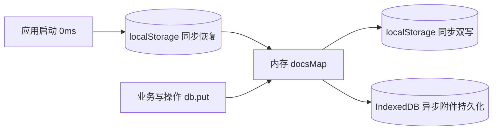

# ZTools / uTools 插件适配为 Ruck 插件通用知识与迁移指南

> **工件定位**：本指南面向 `ZTools-plugins` 仓库内所有存量及新增插件，总结基于纯 Web 标准与垫片层（Shim）将 Electron / Node.js 架构插件平滑移植到 Ruck（Tauri 2.0 + Webview2）运行时的标准化模式、架构契约、避坑准则与最佳实践。

---

## 1. 架构范式转换 (Paradigm Shift)

| 维度 | 原平台 (uTools / ZTools) | 目标平台 (Ruck 桌面端) | 适配核心应对思想 |
| :--- | :--- | :--- | :--- |
| **底层内核** | Electron (Chromium + Node.js 混编) | Tauri 2.0 (Rust 后端 + Webview2 / Wry 前端) | **彻底剥离 Node 原生模块**，用 Web 标准 API（SubtleCrypto、Blob、FileReader 等）重写 |
| **Preload 环境** | 具备完整的 Node.js 原生权限 (`fs`, `crypto`, `child_process`) | 纯现代浏览器环境 (无 Node.js 全局对象，通过 IPC 通信) | 在 Webview 层注入纯 JS 打包的轻量垫片 `preload.js` |
| **API 调用模式** | 部分 API 为历史同步阻塞调用 (如 `showOpenDialog`) | 跨进程 IPC 全面采用**异步 Promise** | **采用 React Fiber 状态直写或事件反向注入**，解耦同步依赖 |
| **安全策略** | 宽松的 `file://` 协议读取权限 | 严格的现代沙箱与 Webview 跨域限制 (禁止普通 DOM 访问 `file:///`) | 附件与媒体流统一采用 **Base64 Data URL** 或 **Blob URL** |

---

## 2. 标准适配工程目录规范 (Project Structure)

为避免单一垫片文件（`preload.js`）无限膨胀，提高可维护性，遵循如下**模块化解耦规范**：

```text
plugins/[plugin-name]/
├── plugin.json               # Ruck 插件清单 (声明 pluginType: "ui"、permissions、features)
├── index.html                # 前端入口 (提前载入 preload.js 并声明 icon 标签)
├── index.js                  # 原插件前端逻辑代码 (保持不修改，保证可维护性)
├── preload.js                # 最终构建产物 (由 build.js 编译生成，供 Webview 加载)
├── build.js                  # 轻量级 esbuild / ESM 打包脚本
└── src-compat/               # [核心] 模块化垫片源码目录
    ├── index.js              # 垫片装配入口，挂载全局对象与生命周期
    ├── ztools.js             # window.ztools / window.utools 宿主接口实现
    ├── services.js           # window.services 服务抽象 (替代 Node 原生 fs/crypto/path)
    ├── database.js           # PouchDB 兼容规范数据库 (双轨持久化层)
    ├── image-picker.js       # (按需) 图片与文件选择、React Fiber 状态注入模块
    └── md5.js                # (按需) 纯 JS 标准哈希算法实现
```

### 构建脚本标准模板 (`build.js`)：
```javascript
import esbuild from "esbuild";

esbuild.buildSync({
  entryPoints: ["src-compat/index.js"],
  bundle: true,
  outfile: "preload.js",
  format: "iife",
  platform: "browser",
  target: ["es2020"]
});
console.log("✅ Preload successfully compiled to preload.js");
```

---

## 3. 核心能力契约对照与垫片设计规范

### 3.1 数据持久化：PouchDB 契约与【双轨持久化】机制
- **接口契约**：`window.ztools.db` 与 `window.ztools.db.promises`，需同时支持同步方法（`get`, `put`, `remove`, `allDocs`, `getAttachment`, `postAttachment`）与对应异步 Promise 方法。
- **痛点**：原生 IndexedDB 全为异步，且在 Webview2 冷启动时可能发生微秒级排队，直接调用同步 `db.get()` 或在 `componentDidMount` 中读取会遭遇空值。
- **治理标准（双轨制）**：
  1. **内存高速层**：使用 `Map` 作为运行时内存主存储；
  2. **启动 0ms 恢复**：模块载入瞬间，同步从 `localStorage` 中将全量 JSON 文档反序列化进内存 `Map`；
  3. **数据写入双写**：在 `put` / `remove` 时，同步写入内存 `Map` 并落盘 `localStorage`，同时异步持久化至 `IndexedDB`（保障大容量二进制附件）。
  4. **异步 Promise 挂起保护**：在 `initDatabase()` 中引入 `Promise.race([loader, timeout(200ms)])`，杜绝事务死锁。



### 3.2 文件选择对话框与 React Fiber 状态直写
- **痛点**：原前端常写有同步代码：
  ```javascript
  const res = window.ztools.showOpenDialog({ filters: [...] });
  if (res) this.setState({ image: res[0] });
  ```
  但在 Ruck 中对话框必然是异步的，原代码同步获取的值恒为 `null` 或未决的 `Promise`。
- **治理标准（React Fiber 注入）**：
  1. 拦截 `showOpenDialog`，唤起标准 Web `<input type="file">`；
  2. 在用户选定文件后，通过 `FileReader` 读取为 Data URL；
  3. 递归遍历 DOM 节点对应的 React Fiber 树（`__reactFiber$` 或 `__reactInternalInstance$`），查找包含 `setState` 与对应业务方法的 ClassComponent 实例；
  4. 直接调用 `formInstance.setState(...)` 更新组件状态，完成状态注入；
  5. 对话框关闭后，**主动调用 `showMainWindow()` 并触发 `remarkInput.focus()`**，恢复前台焦点。

### 3.3 子输入框联动刷新与参数格式
- **痛点**：插件内部通常没有独立的 `refreshList()` 方法，而是通过 `window.ztools.setSubInputValue(text)` 间接驱动插件绑定的搜索回调函数重新过滤列表。
- **规范**：
  ```javascript
  setSubInput(onChange, placeholder = "", isFocus = true) {
    currentSubInputCallback = onChange;
    // Ruck 宿主适配与包装
  },
  setSubInputValue(value) {
    const text = String(value || "");
    ruck?.ui?.setSubInputValue?.(text);
    // 关键：必须主动反向调用回调，且参数必须包装为 { text } 对象！
    if (typeof currentSubInputCallback === "function") {
      currentSubInputCallback({ text });
    }
  }
  ```

### 3.4 动态 Feature 与标签管理
- 原插件多使用 `window.ztools.getFeatures()`, `setFeature()`, `removeFeature()` 动态增删插件内的子功能或标签。
- 垫片中统一采用 `localStorage.getItem("ruck_[plugin]_features")` 即可实现零成本的本地动态指令维护与开箱即用。

### 3.5 快捷粘贴与硬件模拟击键
- 流程：
  1. 插件调用 `ztools.copyText` 或 `copyImage` 将数据写入系统剪贴板；
  2. 调用 `ztools.simulateKeyboardTap("v", "ctrl")`；
  3. 垫片调用 Ruck 宿主 `ruck.clipboard.paste("ctrl_v")`；
  4. 随后调用 `window.ztools.hideMainWindow()` 退出主窗，操作系统焦点回切到目标应用，完成自动粘贴。
- **依赖声明**：`plugin.json` 的 `permissions` 中必须配置 `"clipboard_read"`、`"clipboard_write"`。

---

## 4. 防御性设计与避坑准则 (Defensive Patterns)

### 4.1 默认 Action Code 穿透防范
- **陷阱**：用户在主搜索框搜索插件名回车启动插件时，Ruck 默认传入的 `action.code` 为 `"default"`。若插件只匹配自己的业务 code（如 `"collection"`, `"calc"`），未匹配的 code 会直接掉入 `else` 分支被当作“标签名”过滤，导致列表完全变为空白！
- **防御准则**：在 `onPluginEnter` 垫片层执行归一化：
  ```javascript
  const knownCodes = ["main_feature_1", "main_feature_2", ...customTagCodes];
  if (!action.code || action.code === "default" || action.code === "main" || !knownCodes.includes(action.code)) {
    action.code = "main_feature_1"; // 降级为默认主视图
  }
  ```

### 4.2 80ms 冷启动自愈保底
- **陷阱**：在 Webview2 冷启动或复用时，宿主投递 `ruck://plugin-enter` 事件的时间点可能略早于前端 `componentDidMount` 注册回调的时间点；
- **防御准则**：垫片维护一个 `enterTriggered` 标志位。在前端注册 `onPluginEnter` 后启动 80ms 超时保底。若 80ms 内宿主无消息到达，垫片主动以默认参数触发一次，彻底杜绝白屏/假死。

### 4.3 窗口生命周期与 Escape 退出治理
- 在 Preload 全局拦截 `keydown` 事件：
  ```javascript
  function handleGlobalKeyDown(event) {
    if (event.key === "Escape") {
      const activeEl = document.activeElement;
      // 若当前输入框有输入内容，优先让原生逻辑清空文本；若已为空，退出插件
      if (activeEl && (activeEl.tagName === "INPUT" || activeEl.tagName === "TEXTAREA") && activeEl.value) {
        return;
      }
      event.preventDefault();
      window.ztools.outPlugin();
    }
  }
  window.addEventListener("keydown", handleGlobalKeyDown, true);
  ```

---

## 5. 新插件适配四步速查清单 (Quick Checklist)

- [ ] **Step 1: 权限与清单** (`plugin.json`)
  - 声明 `"pluginType": "ui"`，补充必要的 `permissions`（如 `clipboard_write`, `window_control`）。
- [ ] **Step 2: 入口 HTML 挂载** (`index.html`)
  - 在 `<head>` 第一行加入 `<script src="preload.js"></script>`；
  - 加入 `<link rel="icon" type="image/png" href="logo.png" />` 消除 404 资源错误。
- [ ] **Step 3: 垫片装配** (`src-compat/`)
  - 引入通用 `database.js` 双轨持久化；
  - 引入通用 `services.js` 标准哈希与 Data URL 转换；
  - 编写专用 `ztools.js`，挂载核心 API 与智能生命周期纠偏。
- [ ] **Step 4: 构建与回归测试**
  - 执行 `node build.js` 编译产物；
  - 重点测试：**首次冷启动首屏加载**、**数据增删改即时刷新**、**重启后持久化完好**、**文件/剪贴板交互**。
