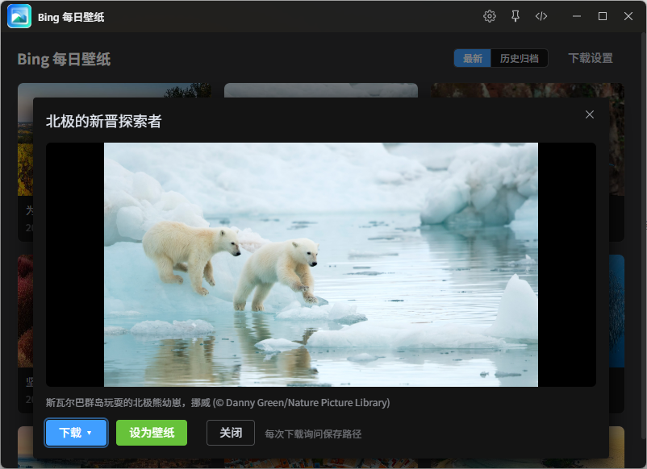

# Bing 每日壁纸



> 浏览 Bing 每日壁纸，看故事、下载、一键设为桌面壁纸。

基于 **Vue 3 + Vite + TypeScript** 的 ZTools 插件。

## 更新日志

### v1.0.0 - 2026-09-17

- 首个正式版本
- 支持浏览最近两周及历史归档的 Bing 每日壁纸，可查看大图、版权信息和每日故事
- 支持下载 1080p / 4K 高清原图，Windows 下一键设为桌面壁纸

## 功能特性

- **浏览**：双图源合并（中国区 + 国际区，跨市场重复图只保留中文版）+ 历史归档（2024-04 至今按年浏览），分页每页 12 张；缩略图统一走 Bing CDN 640x360 小图
- **大图详情**：点击卡片查看大图 + 版权信息 + 每日故事（归档的故事文本更完整）
- **下载**：支持 `1920x1080` 与 `UHD 4K (3840x2160)` 两档分辨率
- **设为壁纸**：一键设置桌面壁纸，固定使用 UHD 4K 原图（仅 Windows）
- **下载路径配置**：
  - 每次下载时弹系统「另存为」对话框选择路径（可改文件名）
  - 或保存到默认目录（初始为 `~/Pictures/BingPaper`，可自选）
- **本地缓存**：已下载图片按日期命名，重复下载/设壁纸自动跳过

## 使用方式

在 ZTools 输入框输入指令进入插件：

- `壁纸` / `bing` / `wallpaper` / `bp`

操作流程：

1. 首屏为最近两周壁纸网格，点击任意卡片打开大图详情
2. 详情中「下载」按钮可选分辨率（1080p / 4K），按配置的路径模式保存
3. 详情中「设为壁纸」直接把当天 UHD 4K 原图设为桌面
4. 右上角「下载设置」切换「每次询问路径」或「默认目录」

## 数据存储说明

- 下载配置（模式 + 默认目录）存于 ZTools `dbStorage`，本地持久化
- 壁纸图片仅保存到本机磁盘（默认 `~/Pictures/BingPaper`），插件不打包、不分发任何图片
- 版权信息（copyright）随图展示，不做抹除
- 联网请求仅访问 `cn.bing.com` 官方接口（免鉴权）

## 技术栈

- Vue 3 + TypeScript + Vite
- Element Plus（unplugin-auto-import / unplugin-vue-components 按需引入）
- ZTools preload（Node.js 能力）：Bing 接口请求绕开 CORS、文件下载落盘、PowerShell `SystemParametersInfo` 设壁纸

## 项目结构

```
.
├── src-ztools/               # ZTools 插件目录（构建后即为完整插件）
│   ├── plugin.json           # 插件配置
│   ├── logo.png
│   ├── preload/
│   │   └── services.js       # Node 能力层（CommonJS，不打包）
│   └── dist/                 # vite 构建产物
├── src/
│   ├── App.vue               # 网格列表 + 大图弹窗 + 下载设置
│   ├── main.ts
│   ├── main.css
│   └── env.d.ts
├── vite.config.js            # Element Plus 按需引入配置
└── package.json
```

## 安装与开发

```bash
npm install      # 安装依赖
npm run dev      # 开发模式（ZTools 加载 http://localhost:5173）
npm run build    # 构建到 src-ztools/dist/
```

构建完成后，`src-ztools/` 目录即为完整插件，可直接加载或发布。

## 许可证

MIT License
