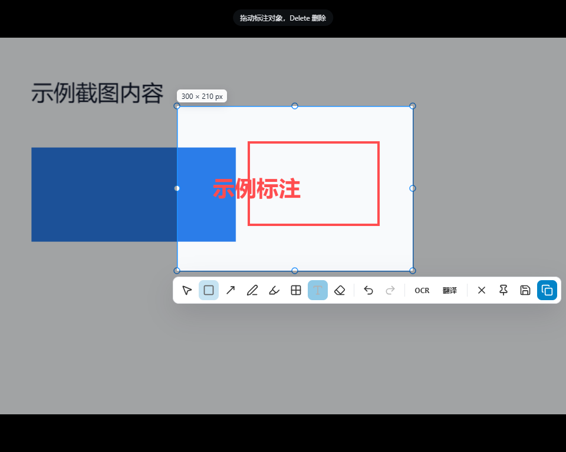
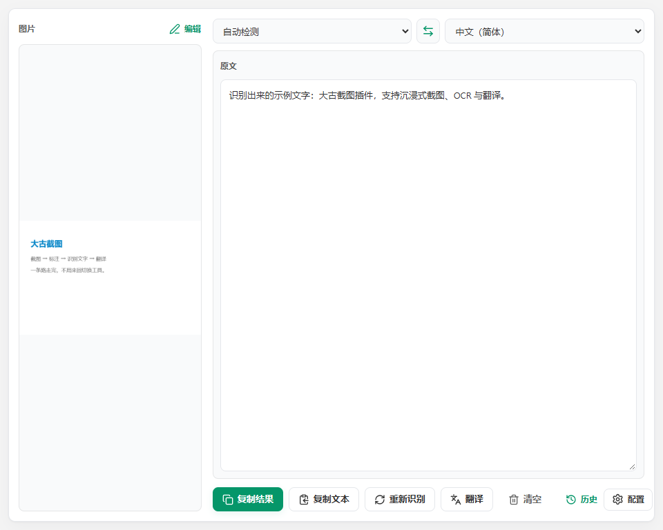
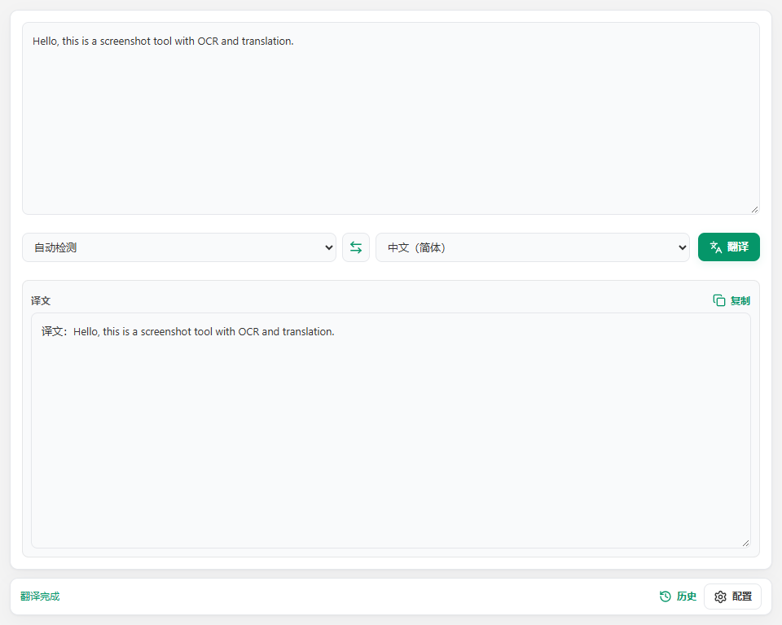

# 大古截图

一个运行在 ZTools 里的截图与 OCR 插件：**截图 → 标注 → 识别文字 → 翻译**，一条路走完，不用来回切换工具。

常见用法举几个例子：

- 想给别人圈重点 → 截图后直接在全屏画面上框选、画矩形/箭头、加文字，再复制成图片发出去。
- 想把截图钉在屏幕上做参考 → 截图后点「固定」，图片会置顶显示，可拖动、滚轮缩放。
- 随手截了张图想裁剪、打马赛克 → 用「编辑图片」就地处理。
- 截图里的字看不清，想变成可复制文本 → 截图后点「图片 OCR」。
- 遇到一段英文/日文，想看懂 → 选中图片点「翻译」，或直接在输入框里粘贴文字翻译。

## 界面一览

沉浸式截图：按下截图后整个屏幕冻结，直接拖拽框选区域，选区下方浮出工具条；在画面上画形状、线条、画笔、荧光笔、马赛克、文字，完成后复制、保存或固定到屏幕。

截图工具：**选择 / 形状 / 线条 / 画笔 / 荧光笔 / 马赛克 / 文字 / 橡皮擦**，右侧是撤销重做、OCR、翻译、取消、固定、保存与复制；滚轮以光标为锚点缩放，空格或中键拖动画面。

「编辑图片」用的是同一个标注界面，只是直接打开图片、不再需要框选。

主工作区：左边是当前图片（可滚轮放大、拖动查看），右边是识别结果（可直接编辑），左右等宽；图片标题行可复制图片，下方可以复制结果、重新识别或翻译。

识别出来的文字原文和译文左右对照，各自的标题行右上角都能一键复制。

## 如何使用

在 ZTools 里输入以下命令即可：

| 入口 | 场景 |
| --- | --- |
| **截图** | 全屏冻结后直接框选标注，可复制、保存、固定到屏幕，也可继续 OCR 或翻译 |
| **图片 OCR** | 传入一张图片直接识别文字；没有剪贴板图片时会上传面板 |
| **翻译文字** | 选中/输入一段文字后翻译 |
| **编辑图片** | 把 ZTools 里的图片送入同一个标注界面，标注后可复制、保存、固定或交给 OCR/翻译 |
| **配置** | 打开设置面板，选择服务、填写密钥 |

每个入口都支持输入同名英文指令：`Screenshot` / `Image OCR` / `Translate Text` / `Edit Image` / `Settings`。

图片来源很自由：截图、拖入文件、点击上传、甚至直接 `Ctrl+V` 粘贴剪贴板里的图片都行。

## 配置

OCR 和翻译各选一个「提供商」（Provider）即可，二选一：

1. **ZTools 提供商（推荐）**：安装 ZTools 的「提供商」插件（f-provider）并配置好渠道，回到本插件设置页会自动识别（比如「微信 OCR」「AI 识图」「百度翻译」），密钥由该插件统一管理，这里不用再填。
2. **大古内置提供商**：在设置页下拉框选「大古内置 · 百度 / 阿里 / MyMemory」，并在下方填入对应服务的密钥。

设置页没有预置密钥，打开后一目了然，照着下拉框和「如何设置提供商？」的提示操作即可。

## 关于密钥与历史记录

- 偏好设置保存在 ZTools 的 `dbStorage`，密钥默认**只保存在本机**。
- 只有手动开启「同步密钥」后，密钥才会写入会随备份同步的副本——请只在你信任的同步环境里开启。
- 识别历史记录始终保存在本机，可从结果操作行右端或页面底部的「历史」入口展开查看、复制或清空。

## 许可

[MIT](./LICENSE)
