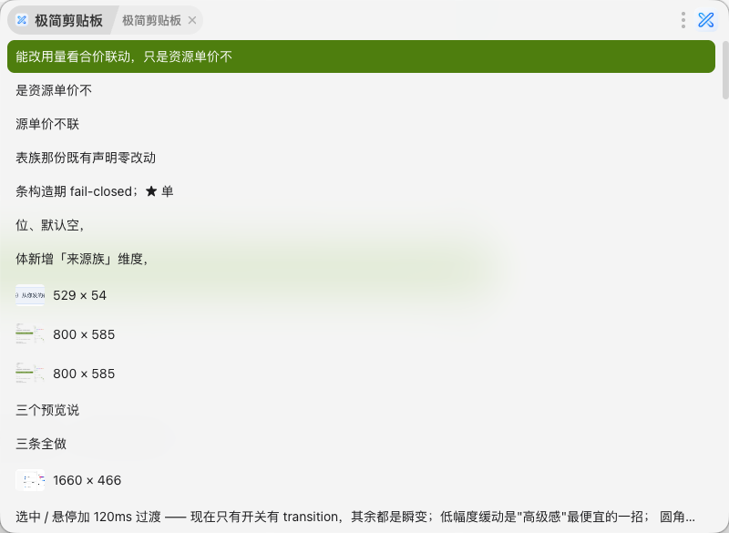
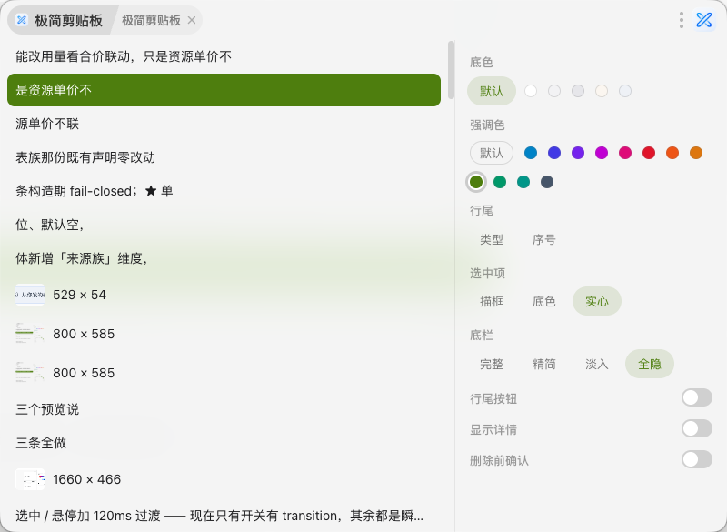

# 极简剪贴板

ZTools 的剪贴板历史插件。打开就是内容，键盘走完全程。

## 特点

- **键盘流**：`↑↓` 选、`Enter` 贴、`Tab` 切分类，设置面板里 `↑↓←→Enter` 也能走完 —— 全程不用碰鼠标
- **五个分类平级**：全部 / 文本 / 图像 / 文件 / 收藏，`Tab` 循环
- **收藏独立**：收藏的内容不掺进历史列表；清历史不影响收藏，清收藏也不影响历史
- **按分类清空**：你在哪个分类，清的就是哪个分类，不会误删别的
- **命中看得见**：搜索时命中的字铺一层强调色底；命中落在长文靠后时，那一行会自动前移成
  `…前文…命中…后文…` —— 不然会出现"这行明明匹配了、屏幕上却一个高亮都看不见"
- **详情浮层**：被截断的文本、图片、多文件可以弹出完整内容（默认关，设置里开）
- **零色差**：默认不画底，露出 ZTools 窗口自己的材质，跟顶部搜索框天然同色；想要实底可以在设置里换
- **底栏可分档**：完整（键位提示 + 设置 / 清空）/ 精简（只有入口）/ 淡入（不占地方，鼠标贴到底部才浮出）/ 全隐（按 `⌘/` 开设置）
- **跟随 ZTools**：深浅色和强调色都跟着宿主走，不另立一套
- **不弹提示框**：所有操作都没有弹窗打断
- **无依赖**：自写 CSS，不带任何 UI 组件库

## 快捷键

| 键                                        | 作用                                               |
| ----------------------------------------- | -------------------------------------------------- |
| `↑` `↓`                             | 选择                                               |
| `Enter`                                 | 粘贴到上一个应用                                   |
| `⌘1`–`⌘9` / `Ctrl+1`–`Ctrl+9` | 直接粘贴第 N 条（行尾开着「序号」时才有编号）      |
| `⌘C` / `Ctrl+C`                      | 只复制，不粘贴（窗口不关）                         |
| `⌘K` / `Ctrl+K`                      | 收藏 / 取消收藏当前项                              |
| `⌘L` / `Ctrl+L`                      | 一步跳到收藏，再按一次退回全部                     |
| `⌘/` / `Ctrl+/`                      | 打开设置                                           |
| `Tab` / `⇧Tab`                       | 下一个 / 上一个分类                                |
| `Delete`（或 `⌘⌫` / `Ctrl+⌫`）   | 删除当前项（默认会先确认，可在设置里关掉）         |
| `Backspace`                             | 退搜索框：有词退一个字，只剩分类前缀就把分类也退掉 |
| `/` 或 `⌘F` / `Ctrl+F`             | 回到搜索框                                         |
| `Esc`                                   | 退一步：先清关键词 → 再清分类 → 再关闭插件       |

鼠标只有两条路，配合行尾那一格用：

| 操作                | 作用                                                                   |
| ------------------- | ---------------------------------------------------------------------- |
| 单击行              | 选中                                                                   |
| 双击行              | 复制（窗口不关）                                                       |
| 行尾`☆` / `🗑` | 收藏 / 删除当前项（鼠标划上去才出现，可在设置里关掉）                  |
| 右下角「设置」      | 打开右侧设置面板（面板里只有控件没有说明，每项什么意思见下面「设置」） |
| 右下角「清空…」    | 清空当前分类，文案会跟着分类变                                         |

> 按 `↑↓` 的时候，键盘焦点会从搜索框交给插件 —— 之后 `⌘K`、`⌘C`、`⌘L`、`⌘/`、`⌘1`–`⌘9`、`Delete`、`⌘⌫` 才按得到。想打字直接敲字母、按 `/`，或者切一下输入法就行。

### 设置面板里

`⌘/`（或右下角「设置」）打开面板后，方向键就在面板里走，不用鼠标：

| 键      | 作用                                                                     |
| ------- | ------------------------------------------------------------------------ |
| `↑` `↓` | 换一项（光标落到这一项**当前的取值**上，不会顺手改掉任何设置）           |
| `←` `→` | 在这一项里换一个：颜色移到哪颗就选哪颗，开关是左关右开                   |
| `Enter` | 落值 / 切换（「行尾」那三颗、以及三个开关，都靠它）                      |
| `Esc`   | 关面板，回到列表                                                         |

有几点跟直觉不太一样，是有意的：

- **「行尾」那三颗是三件独立的事**（类型、序号、来源，各自可开可关，也可以全关），所以 `←→` 只挪光标、**按 `Enter` 才真的切换**。要是做成"移到哪颗就点亮哪颗"，从「类型」滑到「序号」就会顺手把序号也点亮。
- **打开面板时，列表那行的选中会收起** —— 一屏只留一处「选中」，不然列表亮着一行、面板里又亮着一颗，说不清眼前到底在看哪一处。关掉面板它就回来。
- **面板不是模态**：只有 `↑↓←→Enter` 五个键被面板吃掉，`Esc`、`Backspace`、打字、`Tab` 切分类都还是原来的作用。所以面板开着也能接着搜、接着切分类。

## 搜索

搜索框本身就是分类开关，输入法直接打中文：

| 写法            | 结果                   |
| --------------- | ---------------------- |
| `全部:报告`   | 在所有历史里搜「报告」 |
| `文本:报告`   | 只在文本里搜           |
| `图像:`       | 只看图像               |
| `文件:readme` | 按文件名搜             |
| `收藏:`       | 在收藏里搜             |

- 不写前缀 = 全部。`全部:报告` 和不写前缀是一回事
- 全角冒号也认（输入法直接打出来的那个「：」）
- **命中的字会铺一层强调色底**：当前行那一条更重，其余行轻 —— 一屏只留一个重音。命中落在长文靠后、本来会被省略号截掉时，那一行会自动前移成 `…前文…命中…后文…`，保证高亮一定看得见
- 分类名后面可以跟空格
- 切分类会保住关键词：`文本:报告` 按 `Tab` 变成 `图像:报告`
- **图像分类搜不出关键词**：宿主的图片记录里只有尺寸和 `[图片] 123KB` 这样的预览文本，所以「图像:」不带词才是正常用法
- **搜索框一改，列表就从头上看起**：只要搜索框里的内容变了 —— 打字、退一格、退到一半、全部退光，列表都是重新筛过的一张新列表，所以列表回到顶上、当前行回到第一条，接着按 `↑↓` 也是从第一条往下走。不会出现「光标停在列表中间某条」的情况（那条可能已经不在新列表里了）

## 设置

右下角「设置」打开右侧面板。**面板里只有控件、没有一句说明文字**（这一节就是那些说明）。
改完立刻生效，不用重启插件。

面板按**控件类型**分三段，同一种控件挨在一起；每段内部按行**从短到长**排（短的在上面）：

1. **色点段**：底色、强调色
2. **选中段**（药丸）：行尾、选中项、底栏
3. **开关段**：行尾按钮、显示详情、删除前确认

下面按面板里的先后逐项说明。

### 底色

- **默认**：不画底，露出 ZTools 窗口自己的材质 —— 跟顶部搜索框零色差，深浅色也自动跟着走
- 后面五个是实底，**白 → 灰 → 实** 是一条**深浅阶梯**：浅色主题里越往右越深，深色主题里越往右越亮。
  想"面板跟背景分明一点"就往右挑；**暖 / 冷** 只改色温（偏黄一点 / 偏蓝一点），明度跟「白」接近
- 选了实底之后，**详情浮层、设置面板、确认框会跟着用同一个颜色** —— 它们浮在列表上面，
  跟面板不同色会显得这设置没生效

### 强调色

- **默认**：直接用 ZTools 自己的主题色 —— 你在宿主里换了色，这边跟着变
- 后面 12 个色点：给自己另选一个，不受宿主影响（浅色 / 深色主题各有一版，自动切换）
- 这一颗色会影响三处：**当前行**（描框的边、实心的底、底色的淡底都由它算）、面板上的色点、
  底栏两枚入口的悬停色 —— 不用你再去分别配一遍

### 行尾

列表每一行最右边显示什么，**多选**（三个都点掉 = 行尾什么都没有）：

- **类型**：文本 / 链接 / 图像 / 文件
- **序号**：前 9 行的编号，配 `⌘1`–`⌘9` 直接粘贴
- **来源**：这条是在哪个应用里复制的（`VSCode` / `Chrome` / `IDEA`…）。默认关 —— 实测的记录里
  绝大部分只来自两个应用，常驻显示反而是噪声，想知道"这条从哪儿来"的人再打开。
  很老的记录没有这个字段，那一格就不显示，不会冒出一个"未知"。

行尾那两枚 `☆` / `🗑` 按钮由一个单独的开关控制（就是下面的「行尾按钮」）—— 它跟上面三项
叠在同一格，所以开着的时候，**鼠标划过那一行、或者那一行正好是当前选中行**，标签 / 序号 / 来源
都会让位给按钮（两者表现完全一致，不会同一行换个操作方式就长得不一样）。

### 选中项

选中那一行长什么样 —— **三档都是同一个强调色**，只是呈现方式不同：

- **描框**：只描一圈强调色（默认）
- **底色**：铺一层**强调色 13%** 的淡底，外加**左端一根 3px 竖条** —— 13% 很淡，浅色主题下
  看着偏灰是正常的，那根竖条就是补「一眼找到我在哪一行」这件事的
- **实心**：整行铺满强调色、字反白

这一档**不只管列表那一行**：底栏两枚入口的悬停、以及这个面板里"被选中"的那一颗
（药丸铺满 / 描一圈，色点则是一圈粗细跟着变的环）都走同一套 ——
界面上凡是"选中"，只有一种语言，不用分两处各配一遍。

### 底栏

最下面那条：

- **完整**：键位提示 + 设置 / 清空，默认的样子
- **精简**：去掉左边整排键位提示，设置 / 清空还在
- **淡入**：平时不占地方、内容铺到窗口底边；鼠标贴到最下缘才浮出设置 / 清空
- **全隐**：整行都没有、鼠标没有入口 —— **这时只能按 `⌘/` 打开设置**，别忘了这条

### 行尾按钮

鼠标划过一行时，行尾浮出 `☆` 收藏和 `🗑` 删除两枚按钮 —— **鼠标唯一的操作入口**。
关掉之后鼠标只剩「单击选中、双击复制」，收藏和删除要按 `⌘K` 和 `Delete`。

### 显示详情

选中图片、或内容显示不全的行时，在旁边浮出完整内容；换一行就收起。默认开。

### 删除前确认

默认开：按 `Delete` 会先问一句。

**关掉之后按 `Delete` 直接删、不弹框**（键盘流更快），但要记住：

> ⚠️ **删了就找不回来**。宿主那边是硬删，图片连磁盘文件一起删掉，**没有撤销**。
> 这个开关只管删单条 —— 底栏的「清空」永远会先问。

## 安装

1. 打开 ZTools
2. 从插件中心安装，或本地导入构建好的 `.zpx`
3. 输入 `极简剪贴板` 或 `x-clipboard` 唤出

## 许可

MIT
